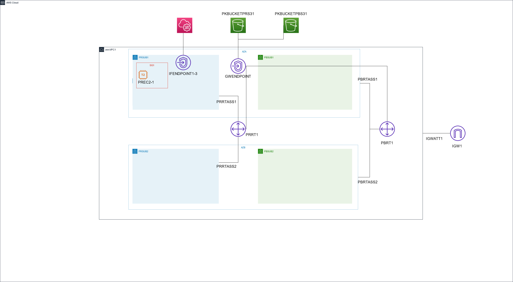

## Architecture


## Deploying the full infrastructure via CLI 
```shell
aws configure --profile cloudguru
aws configure list --profile cloudguru
aws s3 ls --profile cloudguru
```

## Create Main Stack
```shell
PROFILE=cloudguru
STACKNAME=mystack02
REGION=us-east-1
aws cloudformation create-stack \
  --stack-name $STACKNAME \
  --template-body file://./template.yaml \
  --stack-policy-body file://./stack-policy.json \
  --capabilities CAPABILITY_NAMED_IAM CAPABILITY_AUTO_EXPAND \
  --region $REGION \
  --profile $PROFILE
```

## Deploy Main Stack changes.
```shell
PROFILE=cloudguru
STACKNAME=mystack02
REGION=us-east-1
aws cloudformation deploy \
  --stack-name $STACKNAME \
  --template-file test.yaml \
  --capabilities CAPABILITY_NAMED_IAM \
  --region $REGION \
  --profile $PROFILE
```

**CLI commands used:**

--upload file to s3
aws s3 cp cli.txt s3://mystack02-pkbucketpbs31-fxytpnqyev1v --profile $PROFILE

--move file to s3
aws s3 mv movemeCLI.txt s3://mystack02-pkbucketpbs31-fxytpnqyev1v --profile $PROFILE

--sync from local to S3
aws s3 sync . s3://mystack02-pkbucketpbs31-fxytpnqyev1v --profile $PROFILE

