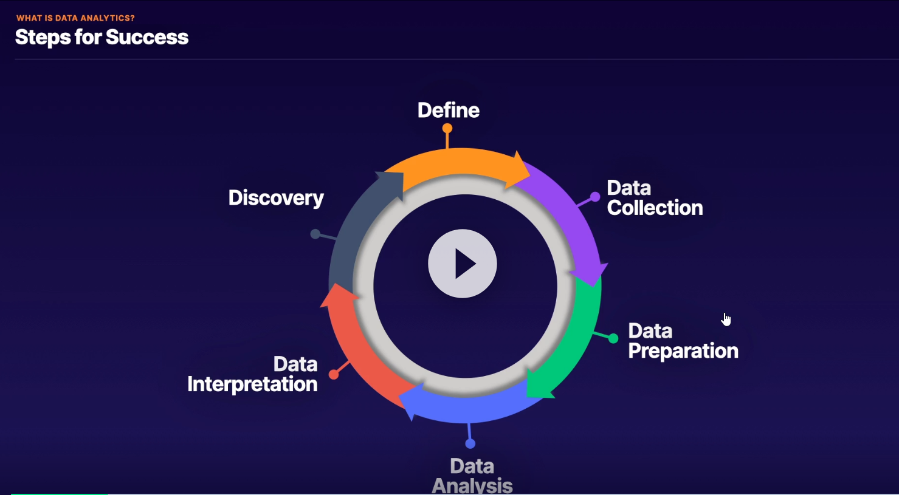
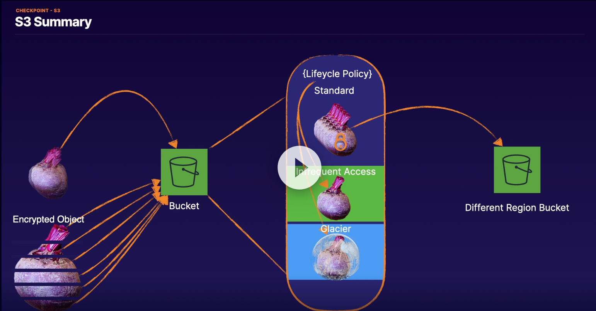

# Data Analytics Specialty
##  Exam Content

1. Domain 1: **Collection**
   1.  Determine the operational characteristics of the collection system
   2.  Select a collection system that handles the frequency, volume, and source of data
   3.  Select a collection system that addresses the key properties of data, such as order, format, and compression
2.  Domain 2: **Storage and Data Management**
    1.  Determine the operational characteristics of a storage solution for analytics
    2.  Determine data access and retrieval patterns
    3.  Select an appropriate data layout, schema, structure, and format
    4.  Define a data lifecycle based on usage patterns and business requirements
    5.  Determine an appropriate system for cataloging data and managing metadata
3.  Domain 3: **Processing**
    1.  Determine appropriate data processing solution requirements
    2.  Design a solution for transforming and preparing data for analysis
    3.  Automate and operationalize a data processing solution
4.  Domain 4: **Analysis and Visualization**
    1.  Determine the operational characteristics of an analysis and visualization solution
    2.  Select the appropriate data analysis solution for a given scenario
    3.  Select the appropriate data visualization solution for a given scenario
5.  Domain 5: **Security**
    1.  Select appropriate authentication and authorization mechanisms
    2.  Apply data protection and encryption techniques
    3.  Apply data governance and compliance controls

##  Data Analytics Overview

Figure - Data Analytics Steps for Success

Digital Use Cases:
1. Application Monitoring
2. Financial Analysis
3. Machine Leanring
4. IoT Management

Relational Databases
 Row based: (OLTP - For Rapid transactions - Protects data through Transaction Processing - Low latency applications)
 1. Aurora (MySQL compatible)
 2. MySql
 3. MariaDB
 4. Oracle
 5. SqlServer
 Column Based: (OLAP - For Analytics workloads - Large amount of data - Complex long running query operations)
 1. Aurora (Postgre SQL compatible)
 2. PostgreSQL
 3. Oracle
 4. Redshift    

Non Relational Databases:
 Key Value Databases:
 1. Elasticache - Memcached - In Memory - all data can be lost
 2. Elasticache - Redis - In Memory but can add disk persistence
 3. DynamoDB - Can be used in Key-Value or Document style - Data model dictates styke - Table structure can't be changed after creation  
 Document Databases:
 1. DynamoDB
 2. DocumentDB - Great for documents (JSON/YAML) - Can hit critical scale failures - MongoDB compatible - Fully Managed - Storage automatically scales upward - JSON Indexing - For SocialMedia profiles / Object Catalogues / Content Management Systems
 Graph Databases:
 1. Neptune - Relational - Data are nodes connected between them with edges - can reveal otherwise hidden patterns in data  - Edges are shared attributes (e.g. job, address)
 Serverlesss Options:
 1. S3 - Provides a selectObjectContent API - on CLI or SDK - Data encoded UTF-8, CSV/JSON/Parquet - Compression - Encryption
 2. Athena - Full RDMS service backed by S3 - SQL interface for data stored in S3 - supports additionally to S3 ORC and Avro formats - runs Presto under the hood - integrates with Quicksight and Glue
 3. DynamoDB - Key/Value and Document store - 
 4. Aurora Serverless  - Can run MySQL or PostgreSQL - Comprised of a Proxy Connection Endpoint - Aurora Capacity Unit (ACU) 1-256 for MySQL and 2-384 for Postgre - Storage

Also:
Amazon Quantum Ledger Database (QLDB): For complete auditing of changes (any change is logged)
Amazon Timestream - Logs every related change in a time series (useful e.g . in IoT cases -=temperature => show graph)
Amazon Keyspaces - Managed Apache Cassandra (NoSQL Database for Real Time Analytics)

## Services:
### Glue & Glue Data Catalog
Glue is a serverless fully managed data integration service (ETL-Extract/Tranform/Load) that makes it easy to discover, prepare and combine data for analytics, ML and app development. I can use AWS Glue to organize, cleanse, validate, and format data for storage in a data warehouse or data lake

Glue Data Catalog is a central repository to store structural and operational metadata for all your data assets. (table definition, physical location, business relevan attributes)

AWS Glue Use Cases:
1. Combine data across multiple data stores to support new applications and features (near real time)
2. Replicate data across multiple data stores 
3. Integrate operational and analytical systems 

Links:
*[Github - aws-glue-samples](https://github.com/aws-samples/aws-glue-samples)*
*[Glue Hands-on by AWS](https://aws-glue-hands-on-labs.workshop.aws/)*
*[Glue Hands-on code by AWS](https://github.com/emrspecialistsamer/aws-glue-workshop)*

### S3 
Data management using Console/CLI/SDK

Transfer Acceleration 
1. for faster Uploads to the buckets (global fast content ingestion)
2. Enabled per bucket
3. TA endpoints
4. Additional Cost

We can use TA while uploading it from boto3

For uploading a LOT of data we can use multipart upload because single S3 PUT allows up to 5GiB, but S3 object can be up to 5TiB

Multipart upload API is done in 3 steps 
1. CreateMultipartUpload API call (returns bucket, key and uploadID)
2. UploadParts (using bucket, Key, uploadId and partNumber) - returns ETag
3. Complete Multipart Upload (using bucket, key, uploadID, all partNumber, and all ETags) - returns Bucket,ETag and Key

Parts of a multipart upload:
1. Can be up to 10.000 parts
2. Can be overwritten
3. Can configure lifecycle policy to auto-abort them
4. Each part (except last) "Must be" >5MiB and <100MiB 

S3 Storage Classes:
**S3 Glacier** can be retrieved a)expedited (5 minutes), b)standard (5 hours), c)bulk (12 hours)

They are moved to IA zone when retrieved. 90 day minimum duration 

**S3 Glacier Deep Archive** can be retrieved within 48 hours

180 day minimum duration

**Intelligent Tiering** is monitoring usage of objects and does the move among tiers automatically

Intelligent Tiering has cost /100k objects and consists of:
1. Frequent Access
2. Infrequent Access
3. Archive (90 day minimum)
4. Deep Archive (180 day minimum)

Ideal on Long Lived data when usage pattern changes a lot

**Lifecycle policy** can be applied from CLI using JSON or XML file

**Security**
All S3 Clients must support at least TLS 1.0, though TLS 1.2+ is recommended

Client must also support Perfect Forward Secrecy (PFS) cipher suites (DHE,ECDHE)

VPC Endpoints allows us the traffic to go through VPC only
VPN can also be used to connect to an S3 bucket
Ideal for security compliance standards like HIPAA (Health Insurance Portability and Accountability Act) 

**Access Control**:
1. SCP
2. IAM
3. Bucket Policies
4. Bucket ACL
5. Object Policies
6. Object ACL

**Auditing**:
1. Cloud Trail logs
2. S3 Server Access Logs
3. Access Analyzer for S3

**Server Side encryption**:
For SSE-S3 and SSE-KMS the Application Server will receive automatically the inencrypted object, for SSE-C (customer managed key) the application code will need to manage the decryption using KMS APIs

**Protection**:
1. Object Locking
2. MFA Delete
3. Versioning

**Replication**:
1. Cross Region Replication

**S3 Best Use Cases:**
1. Storing large amounts of frequently accessed data at low cost
2. As a collection point (buffering) to aggregate data
3. In-cloud store for on-prem data (IA Single AZ)
4. Easy static website hosting
5. For archiving and automatic lifecycle policies
   

Figure - S3 Summary

### DynamoDB
### Kinesis Data Streams
Streaming Data are generated by thousands of Data Sources 
Kinesis DS allows us to collect and process large streams of data records in real time
Data are send to shards. Each shard consist of a sequence of data records. These can be ingested at 1000 records/sec and the data payload can be up to 1MB
1shard = 1MB/sec input data , 1shard = 2MB/sec output
Scaling is accomplished by adding more shards
A shard is a transient data storage with default 24hrs storage, can be increased up to 365 days

With configuration 1 Open shard => (WRITE 1MiB/second, 1000 Data records/second), (READ 2MiB/Sec)

Ways to interact with Kinesis DS:
**Producers:**
1. KPL (Kinesis Producer Library) - allows us to WRITE to the Kinesis Data Stream
2. Kinesis Agent pre-built java application that can be installed on Linux based environments, monitors files and WRITES to the Stream
3. Kinesis API (AWS SDK) - Used for API operations to WRITE to the Kinesis Data Stream
**Consumers:**
1. KCL (Kinesis Client Library) - allows is to READ/CONSUME data from the Kinesis Data Stream
2. Kinesis Data Analytics
3. Kinesis Data Firehose

Use Cases:
1. Analyze system and application logs continuously and process within seconds
2. Real time data analytics on click stream data

### Kinesis Firehose
Kinesis DS allows us to deliver large streams of data near-real time to other services like S3,Splunk, ES etc
### Kinesis Video Streams
Kinesis Video Streams allows us to stream live video from devices to the AWS cloud and build video apps around these streams

### Kinesis Data Analytics
Kinesis Data Analytics allow us to Run SQL queries against Streams

### Redshift and Spectrum
### EMR and Hadoop Ecosystem
### Lambda
### Athena
### Quicksight

### ElasticSearch and Kibana

### RDS & Aurora
RDS is a DB that we manage via management API, but below the hood it is  EC2, EBS, S3, R53...

If we have RDS in Multi AZ, in case of a DR, it will take about 60" to switch the secondary to primary

While for replication it will take approximately 5 minute to promote

Parameter and Option Groups for config

### Neptune
Fully Managed Like Aurora - Multi AZ deployments - Instance Monitoring - Snapshots/Backup - Parameter and Option Groups for config

**Graph DBs** have **Nodes**, which contain **Data** and are linked between them via **Edges**

Neptune supports the following Interface Languages:

1. Apache - TinkerPop Gremlin (e.g. g.V().has('name','location','WA').out('location).values('name','location') )
   1. Graph Structure: Property
   2. Interface: WebSocket
   3. QueryPattern: Traversal
2. W3C - SPARQL Protocol and RDF Query Language (e.g. SELECT ?persion ?location WHERE { <WA> ?location ?person .})
   1. Graph Structure: Resource Description Framework (RDF)
   2. Interface: HTTP Rest
   3. QueryPattern: SQL

Use Cases:
1. Security - recognizing patterns
2. Social Media - Interest graps, Digital advertising
3. Scientific modelling

### Amazon MSK
### IOT Core
### Data Pipeline
### DMS
### Snowball and Direct Connect
### SageMaker
### Security considerations for all above services

## AWS Links
https://www.aws.training/Details/eLearning?id=35364
https://www.aws.training/training/schedule?courseId=10015
https://aws.amazon.com/training/path-data-analytics/
https://www.aws.training/Details/eLearning?id=46612

## White papers and other links
https://d1.awsstatic.com/whitepapers/amazon_emr_migration_guide.pdf?did=wp_card&trk=wp_card
https://d1.awsstatic.com/whitepapers/Big_Data_Analytics_Options_on_AWS.pdf?did=wp_card&trk=wp_card
https://d1.awsstatic.com/whitepapers/lambda-architecure-on-for-batch-aws.pdf?did=wp_card&trk=wp_card
https://d1.awsstatic.com/whitepapers/whitepaper-streaming-data-solutions-on-aws-with-amazon-kinesis.pdf?did=wp_card&trk=wp_card
https://d1.awsstatic.com/whitepapers/teaching-big-data-skills-amazon-emr.pdf?did=wp_card&trk=wp_card
https://d1.awsstatic.com/architecture-diagrams/ArchitectureDiagrams/sql_based_data_processing_amazon_ecs.pdf?did=wp_card&trk=wp_card

*[Big Data Analytics Options on AWS](https://d1.awsstatic.com/whitepapers/Big_Data_Analytics_Options_on_AWS.pdf)*
*[Lambda Architecture for Batch and Stream Processing](https://d1.awsstatic.com/whitepapers/lambda-architecure-on-for-batch-aws.pdf)*
*[Use Amazon ES to Log and Monitor Almost Everything](https://d0.awsstatic.com/whitepapers/whitepaper-use-amazon-elasticsearch-to-log-and-monitor-almost-everything.pdf?ref=wellarchitected)*
*[Streaming Data Solutions on AWS with Amazon Kinesis](https://d0.awsstatic.com/whitepapers/whitepaper-streaming-data-solutions-on-aws-with-amazon-kinesis.pdf)*
*[Best Practices for Data Warehousing with Amazon Redshift](https://www.aws.training/Details/Video?id=26851)*

FAQs:Amazon Athena | Amazon EMR | Amazon Redshift | Amazon CloudSearch | Amazon Kinesis Video Streams | Amazon Kinesis Data Streams | Amazon Kinesis Data Firehose | Amazon Kinesis Data Analytics  | Amazon ElasticSearch Service | Amazon Managed Service for Kafka (MSK) | Amazon Redshift | Amazon QuickSight | AWS Data Exchange | AWS Glue | AWS Lake Formation | AWS Data PipelineView all FAQs

re:Invent
*[High Performance Data Streaming with Amazon Kinesis: Best Practices (ANT322-R1)](https://www.youtube.com/watch?v=jKPlGznbfZ0)*
*[A Deep Dive into What's New with Amazon EMR (ANT340-R1)](https://www.youtube.com/watch?v=ISl9sTzxoSo&list=PL2byMoCZ9UcJ8mt9NbR845Hti9fl7HEX0)*
*[Big Data Analytics Architectural Patterns & Best Practices (ANT201-R1)](https://www.youtube.com/watch?v=ovPheIbY7U8&list=PL2byMoCZ9UcJ8mt9NbR845Hti9fl7HEX0)*
*[Deep Dive and Best Practices for Amazon Redshift (ANT401-R1)](https://www.youtube.com/watch?v=TJDtQom7SAA&list=PL2byMoCZ9UcJ8mt9NbR845Hti9fl7HEX0)*
*[Effective Data Lakes: Challenges and Design Patterns (ANT316)](https://www.youtube.com/watch?v=v5lkNHib7bw&list=PL2byMoCZ9UcJ8mt9NbR845Hti9fl7HEX0)*
*[Amazon Redshift Masterclass - Note that this link starts the video at the 18:30 mark, which is where the technical information starts and the marketing crap stops.](https://www.youtube.com/watch?v=GgLKodmL5xE&list=PL2byMoCZ9UcJ8mt9NbR845Hti9fl7HEX0&t=1110s)*
*[Amazon DynamoDB Deep Dive: Advanced Design Patterns for DynamoDB (DAT401)](https://www.youtube.com/watch?v=HaEPXoXVf2k&list=PL2byMoCZ9UcJ8mt9NbR845Hti9fl7HEX0)*