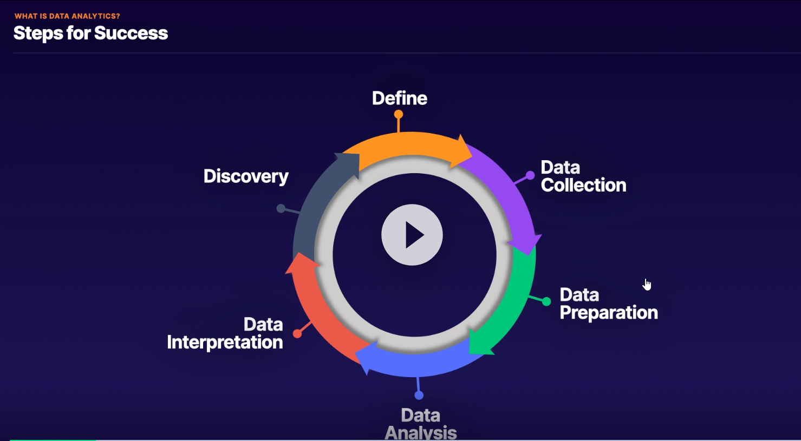

# Data Analytics Specialty
##  Exam Content

1. Domain 1: **Collection**
   1.  Determine the operational characteristics of the collection system
   2.  Select a collection system that handles the frequency, volume, and source of data
   3.  Select a collection system that addresses the key properties of data, such as order, format, and compression
2.  Domain 2: **Storage and Data Management**
    1.  Determine the operational characteristics of a storage solution for analytics
    2.  Determine data access and retrieval patterns
    3.  Select an appropriate data layout, schema, structure, and format
    4.  Define a data lifecycle based on usage patterns and business requirements
    5.  Determine an appropriate system for cataloging data and managing metadata
3.  Domain 3: **Processing**
    1.  Determine appropriate data processing solution requirements
    2.  Design a solution for transforming and preparing data for analysis
    3.  Automate and operationalize a data processing solution
4.  Domain 4: **Analysis and Visualization**
    1.  Determine the operational characteristics of an analysis and visualization solution
    2.  Select the appropriate data analysis solution for a given scenario
    3.  Select the appropriate data visualization solution for a given scenario
5.  Domain 5: **Security**
    1.  Select appropriate authentication and authorization mechanisms
    2.  Apply data protection and encryption techniques
    3.  Apply data governance and compliance controls

##  Data Analytics Overview

Figure - Data Analytics Steps for Success

Digital Use Cases:
1. Application Monitoring
2. Financial Analysis
3. Machine Leanring
4. IoT Management

## Services:
### Glue & Glue Data Catalog
### S3 
Data management using Console/CLI/SDK
Transfer Acceleration 
1. for faster Uploads to the buckets (global fast content ingestion)
2. Enabled per bucket
3. TA endpoints
4. Additional Cost

### DynamoDB
### Kinesis Data Streams
### Kinesis Firehose
### Redshift and Spectrum
### EMR and Hadoop Ecosystem
### Lambda
### Athena
### Quicksight
### Kinesis Data Analytics
### ElasticSearch and Kibana
### RDS & Aurora
### Amazon MSK
### IOT Core
### Data Pipeline
### DMS
### Snowball and Direct Connect
### SageMaker
### Security considerations for all above services

## AWS Links
https://www.aws.training/Details/eLearning?id=35364
https://www.aws.training/training/schedule?courseId=10015
https://aws.amazon.com/training/path-data-analytics/
https://www.aws.training/Details/eLearning?id=46612

## White papers and other links
https://d1.awsstatic.com/whitepapers/amazon_emr_migration_guide.pdf?did=wp_card&trk=wp_card
https://d1.awsstatic.com/whitepapers/Big_Data_Analytics_Options_on_AWS.pdf?did=wp_card&trk=wp_card
https://d1.awsstatic.com/whitepapers/lambda-architecure-on-for-batch-aws.pdf?did=wp_card&trk=wp_card
https://d1.awsstatic.com/whitepapers/whitepaper-streaming-data-solutions-on-aws-with-amazon-kinesis.pdf?did=wp_card&trk=wp_card
https://d1.awsstatic.com/whitepapers/teaching-big-data-skills-amazon-emr.pdf?did=wp_card&trk=wp_card
https://d1.awsstatic.com/architecture-diagrams/ArchitectureDiagrams/sql_based_data_processing_amazon_ecs.pdf?did=wp_card&trk=wp_card

*[Big Data Analytics Options on AWS](https://d1.awsstatic.com/whitepapers/Big_Data_Analytics_Options_on_AWS.pdf)*
*[Lambda Architecture for Batch and Stream Processing](https://d1.awsstatic.com/whitepapers/lambda-architecure-on-for-batch-aws.pdf)*
*[Use Amazon ES to Log and Monitor Almost Everything](https://d0.awsstatic.com/whitepapers/whitepaper-use-amazon-elasticsearch-to-log-and-monitor-almost-everything.pdf?ref=wellarchitected)*
*[Streaming Data Solutions on AWS with Amazon Kinesis](https://d0.awsstatic.com/whitepapers/whitepaper-streaming-data-solutions-on-aws-with-amazon-kinesis.pdf)*
*[Best Practices for Data Warehousing with Amazon Redshift](https://www.aws.training/Details/Video?id=26851)*

FAQs:Amazon Athena | Amazon EMR | Amazon Redshift | Amazon CloudSearch | Amazon Kinesis Video Streams | Amazon Kinesis Data Streams | Amazon Kinesis Data Firehose | Amazon Kinesis Data Analytics  | Amazon ElasticSearch Service | Amazon Managed Service for Kafka (MSK) | Amazon Redshift | Amazon QuickSight | AWS Data Exchange | AWS Glue | AWS Lake Formation | AWS Data PipelineView all FAQs

re:Invent
*[High Performance Data Streaming with Amazon Kinesis: Best Practices (ANT322-R1)](https://www.youtube.com/watch?v=jKPlGznbfZ0)*
*[A Deep Dive into What's New with Amazon EMR (ANT340-R1)](https://www.youtube.com/watch?v=ISl9sTzxoSo&list=PL2byMoCZ9UcJ8mt9NbR845Hti9fl7HEX0)*
*[Big Data Analytics Architectural Patterns & Best Practices (ANT201-R1)](https://www.youtube.com/watch?v=ovPheIbY7U8&list=PL2byMoCZ9UcJ8mt9NbR845Hti9fl7HEX0)*
*[Deep Dive and Best Practices for Amazon Redshift (ANT401-R1)](https://www.youtube.com/watch?v=TJDtQom7SAA&list=PL2byMoCZ9UcJ8mt9NbR845Hti9fl7HEX0)*
*[Effective Data Lakes: Challenges and Design Patterns (ANT316)](https://www.youtube.com/watch?v=v5lkNHib7bw&list=PL2byMoCZ9UcJ8mt9NbR845Hti9fl7HEX0)*
*[Amazon Redshift Masterclass - Note that this link starts the video at the 18:30 mark, which is where the technical information starts and the marketing crap stops.](https://www.youtube.com/watch?v=GgLKodmL5xE&list=PL2byMoCZ9UcJ8mt9NbR845Hti9fl7HEX0&t=1110s)*
*[Amazon DynamoDB Deep Dive: Advanced Design Patterns for DynamoDB (DAT401)](https://www.youtube.com/watch?v=HaEPXoXVf2k&list=PL2byMoCZ9UcJ8mt9NbR845Hti9fl7HEX0)*