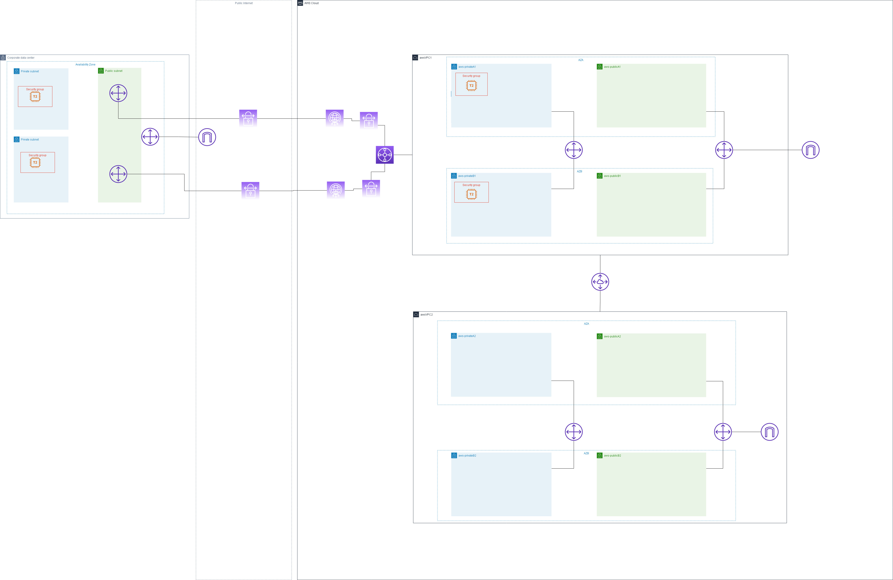
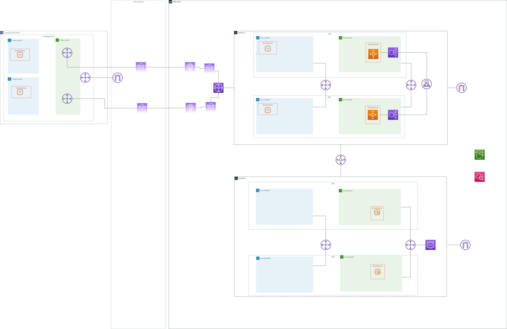
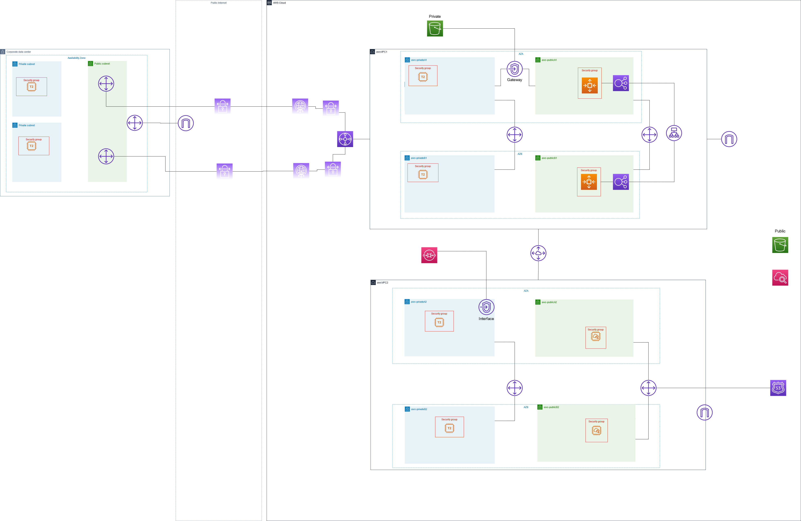

# aws-playground
Playground for CloudFormation - This project will be built up incrementally trying to setup an environment for experimentation

**BEWARE!!! - Costs may apply** when running the CloudFormation template. This is designed for execution on aCloudGuru/Linux Academy's playground for experimentation and setting up a big infrastructure

## Infrastructure
Progressive Versions

### V1 (One VPC with Internet Connectivity on two AZ) 

### V2 (+Second VPC, VPC peering, routing across private subnets) 

### V3 (+Transit GW with BGP, SG and EC2 on private subnets , On Prem infrastructure )

### V4 (+2 Public EC2 with Route 53, one with index and one for failover, + 2ASG with ALB )
(Requires a DNS/Hosting zone)

### V5 (+Gateway Endpoint, S3 private access, Interface Endopoint, SNS private access)

