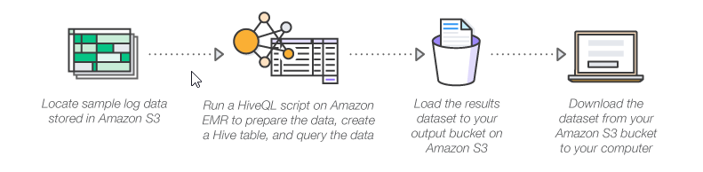

## Analyze big data with Hadoop
https://aws.amazon.com/getting-started/hands-on/analyze-big-data/?trk=gs_card




Steps:
1. Create EC2 keypair (to be able to access later on EC2s) - named "myemrkeypair"
2. Create S3 bucket named "pkammasemrbucket"
3. Upload health_violations.py to S3 bucket
4. Upload food_establishment_data.csv to S3 bucket
5. Run on CLI:
```
PROFILE=cloudguru

aws configure --profile  $PROFILE

aws iam remove-role-from-instance-profile --instance-profile-name EMR_EC2_DefaultRole \
    --role-name EMR_EC2_DefaultRole --profile $PROFILE
aws iam delete-instance-profile \
    --instance-profile-name EMR_EC2_DefaultRole --profile $PROFILE
aws iam detach-role-policy \
  --role-name EMR_EC2_DefaultRole \
  --policy-arn arn:aws:iam::aws:policy/service-role/AmazonElasticMapReduceforEC2Role --profile $PROFILE
aws iam delete-role --role-name EMR_EC2_DefaultRole --profile $PROFILE
aws iam detach-role-policy --role-name EMR_DefaultRole \
    --policy-arn arn:aws:iam::aws:policy/service-role/AmazonElasticMapReduceRole --profile $PROFILE
aws iam delete-role --role-name EMR_DefaultRole --profile $PROFILE


aws emr create-default-roles --profile $PROFILE

aws emr create-cluster \
--name "My X EMR Cluster" \
--release-label emr-5.32.0 \
--applications Name=Spark \
--ec2-attributes KeyName=myemrkeypair \
--instance-type m5.xlarge \
--instance-count 3 \
--profile $PROFILE \
--use-default-roles

aws emr describe-cluster --cluster-id j-1Z1OGPG20SASE --profile $PROFILE

```
