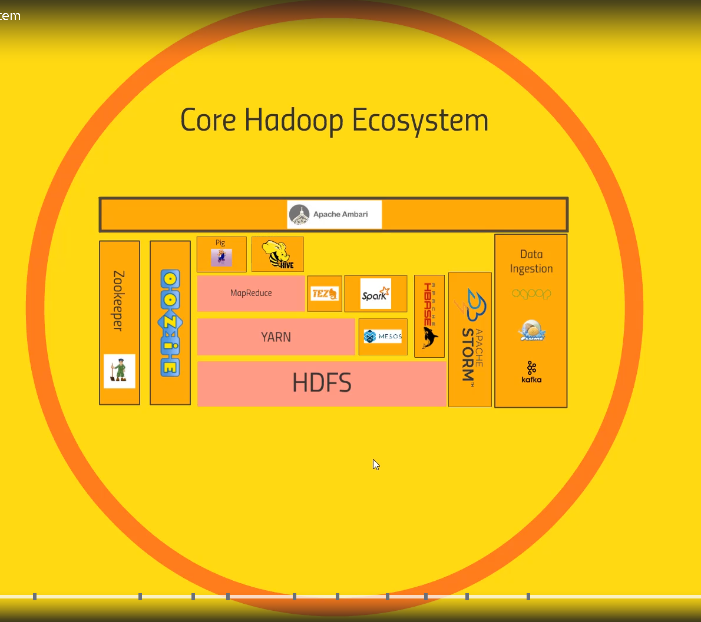
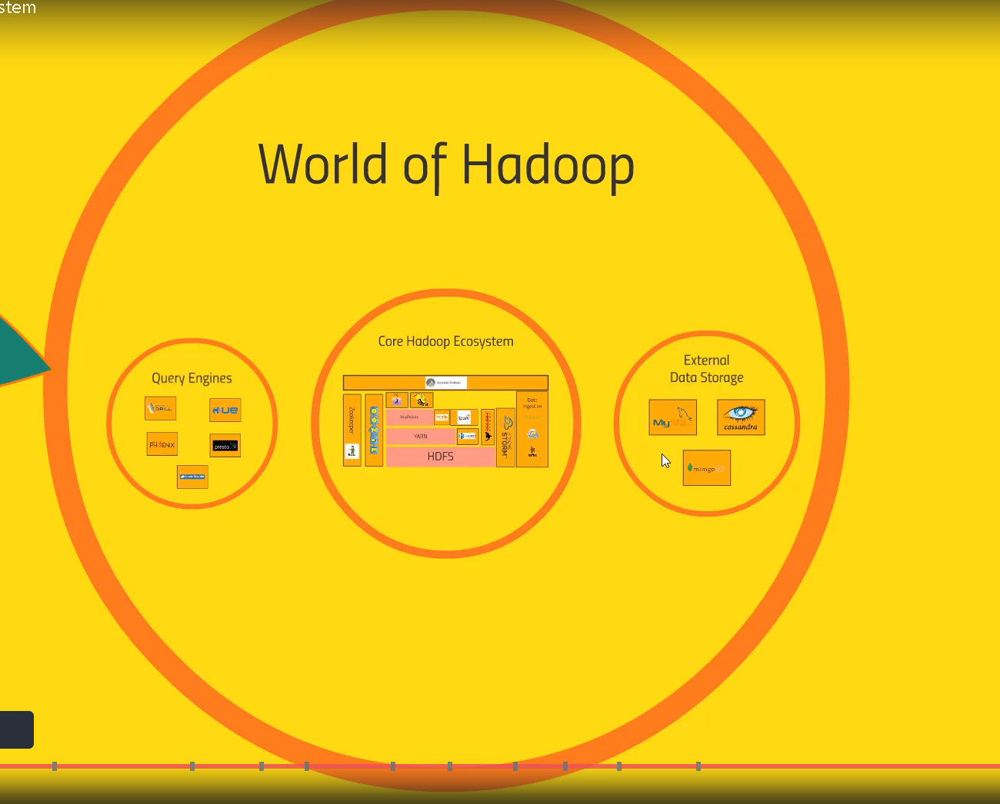
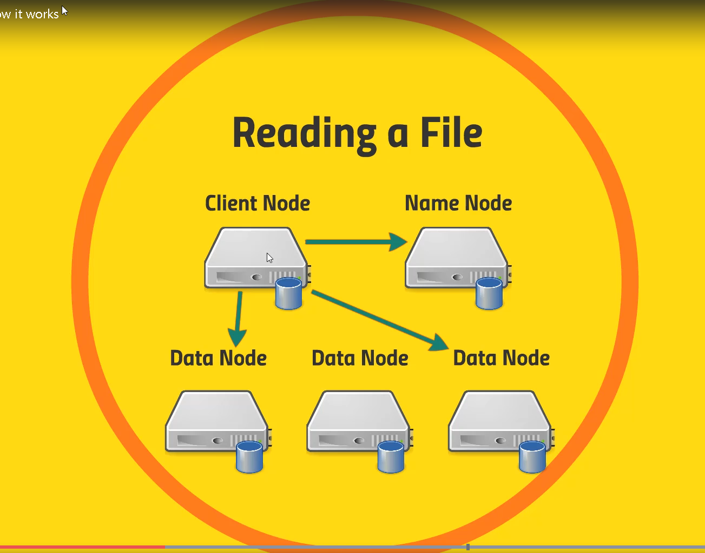
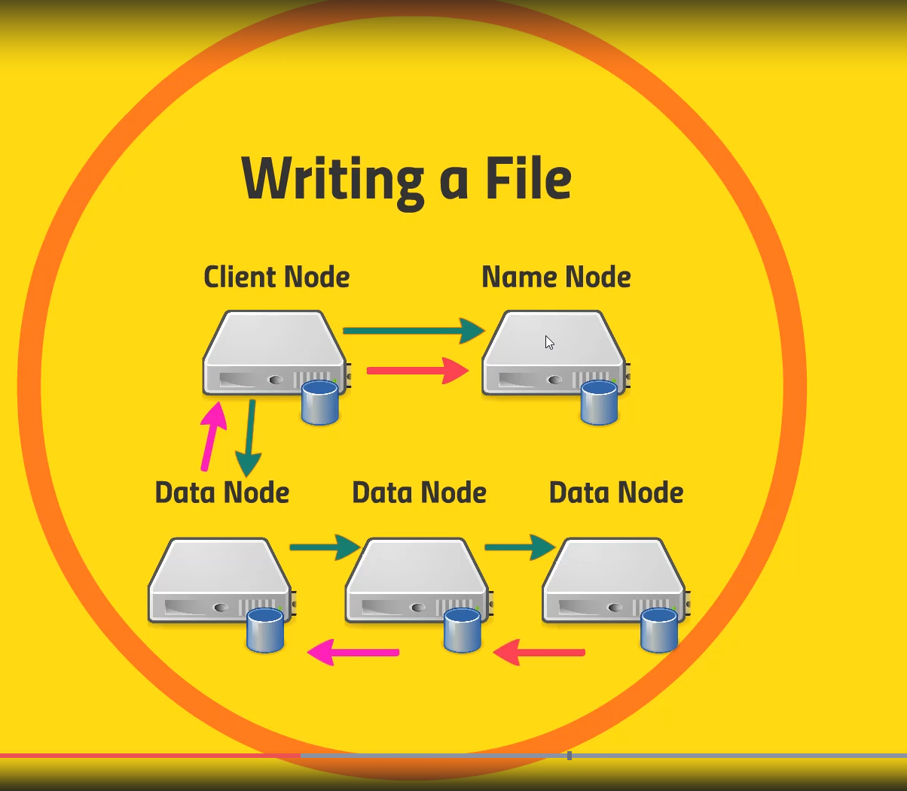
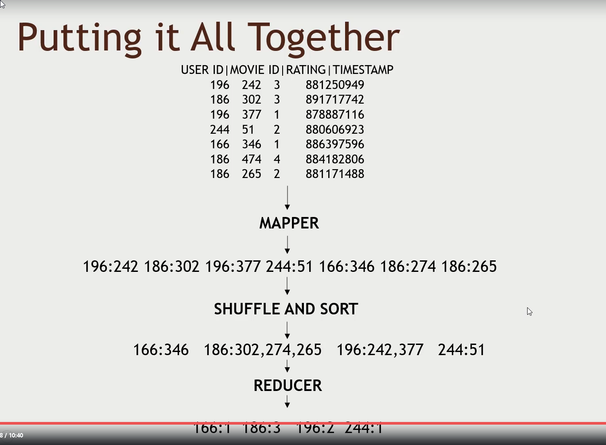
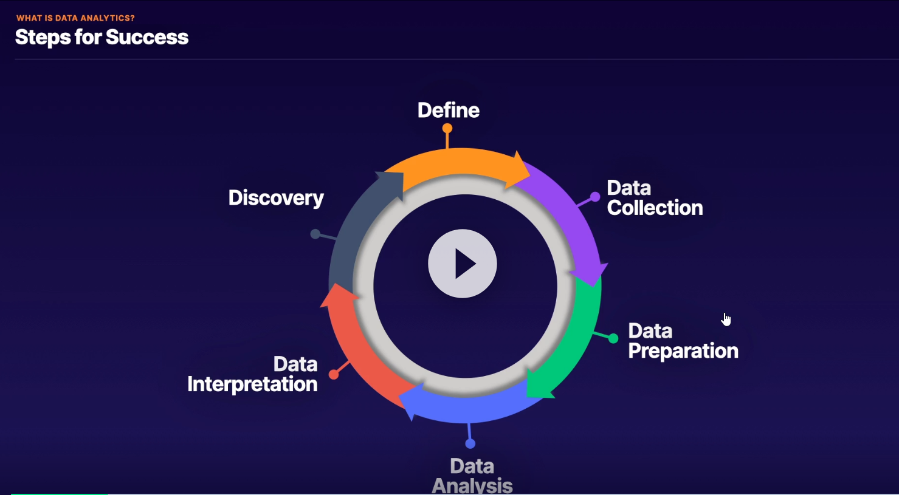
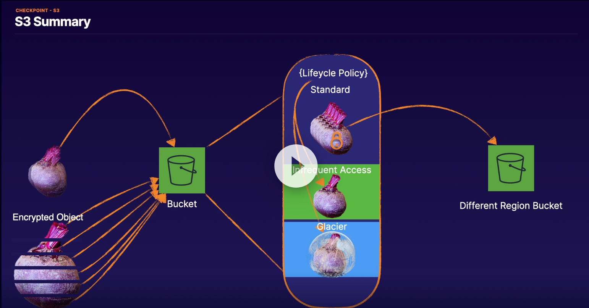

# Data Analytics Specialty
##  Exam Content

1. Domain 1: **Collection**
   1.  Determine the operational characteristics of the collection system
   2.  Select a collection system that handles the frequency, volume, and source of data
   3.  Select a collection system that addresses the key properties of data, such as order, format, and compression
2.  Domain 2: **Storage and Data Management**
    1.  Determine the operational characteristics of a storage solution for analytics
    2.  Determine data access and retrieval patterns
    3.  Select an appropriate data layout, schema, structure, and format
    4.  Define a data lifecycle based on usage patterns and business requirements
    5.  Determine an appropriate system for cataloging data and managing metadata
3.  Domain 3: **Processing**
    1.  Determine appropriate data processing solution requirements
    2.  Design a solution for transforming and preparing data for analysis
    3.  Automate and operationalize a data processing solution
4.  Domain 4: **Analysis and Visualization**
    1.  Determine the operational characteristics of an analysis and visualization solution
    2.  Select the appropriate data analysis solution for a given scenario
    3.  Select the appropriate data visualization solution for a given scenario
5.  Domain 5: **Security**
    1.  Select appropriate authentication and authorization mechanisms
    2.  Apply data protection and encryption techniques
    3.  Apply data governance and compliance controls

## General Big Data
We have created a Haddop Cluster and we administer it using Ambari (Hortonworks Sandbox)
We can upload to Hive the CSVs, by specifying the field delimiter, we give it a table name and table columns and afterwards we can run Hive Queries
When we run a Hive query, the SQL is converted to MapReduce Jobs, executed and returns the results

**Hadoop Ecosystem:**
1. Core Hadoop:
   1. HDFS (allows us to distribute the storage + maintain redundant copies)
   2. YARN (Yet Another Resource Negotiator - the system that manages the resources on the cluster - orchestrator)
   3. Mesos (alternative to YARN)
   4. MapReduce (Programming model to process data)
   5. Spark (can run on top of YARN or MESOS like MapReduce - needs programming using Java/Python/Scala)
   6. TEZ (usually used along with Hive to accelerate it) - faster than MapReduce
   7. Pig (For SQL friends that want to avoid Java/Python - Pig will transform it to code)
   8. Hive (Allows us to execute SQL queries like when having a relational DB)
   9. Apache Ambari (UI for everything in Core Hadoop) - Competitors Cloudera/MapR
   10. HBASE (No SQL database storing processed data so that they can be fetched by webapps or similar)
   11. Apache Storm (process streaming data)
   12. Oozie (can act like an orchstrator driving data to various technologie)
   13. zookeeper (technology for coordinating everything - which nodes are up/down)
   14. data ingestion
       1.  Scoop (connector to legacy DBs)
       2.  Flume (fleet of web servers)
       3.  Kafka (collects data from any source and broadcasts them to the hadoop cluster)
2. Query Engines:
   1. Apache Drill: (write SQL queries towards an HBase or Cassandra)
   2. Hue: (write queries )
   3. Phoenix: (provides also ACID guarantees)
   4. Presto: (execute queries to the entire cluster)
   5. Apache Zeppelin: (notebook approach to interacting with the cluster)
3. External Data Storage:
   1. MySql (can receive data from Core Hadoop)
   2. Cassandra (columnar data store - eg for web Application)
   3. mongo DB (document data store - eg for web application)

HDFS splits huge files into smaller blocks across several computers

**Reading a File in Hadoop**

**Writing a file in Hadoop**

Name Node resilience:
1. Backup Metadata (writes to localdisk and NFS) - easy but not best way
2. Secondary Namenode - copy to restore (slightly better)
3. HDFS Federation - Namenode may have specific namespace volume (partitioning)
4. HDFS High Availability - Best way - Hot Standby namenode using shared edit log (not hdfs shared log + zookeeper for client to know where client to talk to) - to ensure only one namenode is up at all times extreme measures can be taken (e.g. zookeper may trigger instant power down to other namenode)

Using HDFS:
1. UI (Ambari)
2. CLI
3. HTTP/HDFS Proxies
4. Java interface
5. NFS Gateway

MapReduce: To make the mapping we split the input data based on the key that we want them to be aggregated later on - the "for each" (e.g. the user in the "how many movies each user rated question" )
**Mapper** first keeps the Key,Value and dumps the rest of the data to reduce bandwidth
**MapReduce automatically** does the "**Shuffle and Sort**" -> sorts keys and groups values by their keys to avoid duplicate keys
**Reducer** can easilly use the list of values for each key to calculate the result for each key

Mappers and Reducers can be written in Python using the Streaming of stdIn and stdOut (so a mapper will send data to stdIn and receive data to stdOut)

Handling Failure:
Application Master makes restarts ad needed
Alternatively YARN will try to restart Application Master
Alternatively the Resource Manager will try to restart the Node
Alternatively Zookeeper can be configured to have a hot standby

Usually for MapReduce and Python we can use mrjob and mrstep libraries

Ampari:
1. Can be the first step to install Ampari and then install everything from there
2. Full Dashboard for Hadoop Cluster 

Pig:
1. Allows us to use Pog Latin as an SQL Like Scripting language to define map and reduce steps instead of using map reduce, mappers and reducers which are harder to use
2. Highly extensible with User Defined Functions
3. If run with TEZ it can outperform MapReduce performance
4. I can have UDF in jar files (java)

Spark:
1. Can run on a hadoop cluster or its own cluster
2. With Python,Java or Scala can provide a Resilient Distributed Dataset (RDD)
3. Compoenents: 
   1. Spark Core 
   2. Spark Streaming 
   3. Spark SQL 
   4. MLLib (for ML) 
   5. GraphX (Graph/Social Network etc)
4. Scala is better than Python for Spark

**Spark RDD (Resilient Distributed Dataset)**

Creating RDDs:
1. creating an RDD named nums: nums=parallelize([1,2,3,4])
2. text file from file, s3, hdfs
3. from a hive context
4. jdbc
5. cassandra
6. HBase
7. Elasticsearch
8. JSON,CSV,sequence files, object files, various compressed files

What we can do with RDDs:
1. map (when target is the same nr of rows as source)
2. flatmap (when i want to change the target nr of rows based on criteria)
3. filter (to remove rows based on criteria)
4. distinct (the distinct unique values in an RDD)
5. sample (random lines)
6. union, intersection, subtract, cartesian

RDD Actions:
1. collect
2. count
3. countByValues
4. take
5. top
6. reduce
7. ...more...

spark-submit allows me to run from CLI pySPark scripts using the cluster and not a single node/thread   

**SparkSQL and Spark 2.0 (best way) of doing things:**
We are able to extend RDDs to a DataFrame object (row objects which can contain stuctured Data)
**DataFrame** is really a **DataSet** of Row Objects
DataSets can inform us better on compile time about errors

Querying using Spark and DataFrames:
1. Import SparkSession,Row and functions
2. Convert Text File --> Rdd --> DataFrame
3. Apply function on dataFrame to get groupBy movieId rating
4. Apply function on dataFrame to get groupBy movieId count
5. Join count and rating

ML Lib:
1. same as above create a DataFrame containing userId,movieId, rating
2. Cache this DataFrame to avoid recreating
3. 

##  Data Analytics Overview

Big Data are defined by:
1. Volume (how many they are)
2. Velocity (how fast they grow)
3. Variety (how different they are - video/text/images etc)

Do the above factors affect our ability to extract value?

Figure - Data Analytics Steps for Success

Digital Use Cases:
1. Application Monitoring
2. Financial Analysis
3. Machine Leanring
4. IoT Management

Relational Databases
 Row based: (OLTP - For Rapid transactions - Protects data through Transaction Processing - Low latency applications)
 1. Aurora (MySQL compatible)
 2. MySql
 3. MariaDB
 4. Oracle
 5. SqlServer
 Column Based: (OLAP - For Analytics workloads - Large amount of data - Complex long running query operations)
 1. Aurora (Postgre SQL compatible)
 2. PostgreSQL
 3. Oracle
 4. Redshift    

Non Relational Databases:
 Key Value Databases:
 1. Elasticache - Memcached - In Memory - all data can be lost
 2. Elasticache - Redis - In Memory but can add disk persistence
 3. DynamoDB - Can be used in Key-Value or Document style - Data model dictates styke - Table structure can't be changed after creation  
 Document Databases:
 1. DynamoDB
 2. DocumentDB - Great for documents (JSON/YAML) - Can hit critical scale failures - MongoDB compatible - Fully Managed - Storage automatically scales upward - JSON Indexing - For SocialMedia profiles / Object Catalogues / Content Management Systems
 Graph Databases:
 1. Neptune - Relational - Data are nodes connected between them with edges - can reveal otherwise hidden patterns in data  - Edges are shared attributes (e.g. job, address)
 Serverlesss Options:
 1. S3 - Provides a selectObjectContent API - on CLI or SDK - Data encoded UTF-8, CSV/JSON/Parquet - Compression - Encryption
 2. Athena - Full RDMS service backed by S3 - SQL interface for data stored in S3 - supports additionally to S3 ORC and Avro formats - runs Presto under the hood - integrates with Quicksight and Glue
 3. DynamoDB - Key/Value and Document store - 
 4. Aurora Serverless  - Can run MySQL or PostgreSQL - Comprised of a Proxy Connection Endpoint - Aurora Capacity Unit (ACU) 1-256 for MySQL and 2-384 for Postgre - Storage

Also:
Amazon Quantum Ledger Database (QLDB): For complete auditing of changes (any change is logged)
Amazon Timestream - Logs every related change in a time series (useful e.g . in IoT cases -=temperature => show graph)
Amazon Keyspaces - Managed Apache Cassandra (NoSQL Database for Real Time Analytics)

## Services:
### Glue & Glue Data Catalog
Glue is a serverless fully managed data integration service (ETL-Extract/Tranform/Load) that makes it easy to discover, prepare and combine data for analytics, ML and app development. I can use AWS Glue to organize, cleanse, validate, and format data for storage in a data warehouse or data lake

Glue Data Catalog is a central repository to store structural and operational metadata for all your data assets. (table definition, physical location, business relevan attributes)

AWS Glue Use Cases:
1. Combine data across multiple data stores to support new applications and features (near real time)
2. Replicate data across multiple data stores 
3. Integrate operational and analytical systems 

Links:
*[Github - aws-glue-samples](https://github.com/aws-samples/aws-glue-samples)*
*[Glue Hands-on by AWS](https://aws-glue-hands-on-labs.workshop.aws/)*
*[Glue Hands-on code by AWS](https://github.com/emrspecialistsamer/aws-glue-workshop)*

### S3 
Data management using Console/CLI/SDK

Transfer Acceleration 
1. for faster Uploads to the buckets (global fast content ingestion)
2. Enabled per bucket
3. TA endpoints
4. Additional Cost

We can use TA while uploading it from boto3

For uploading a LOT of data we can use multipart upload because single S3 PUT allows up to 5GiB, but S3 object can be up to 5TiB

Multipart upload API is done in 3 steps 
1. CreateMultipartUpload API call (returns bucket, key and uploadID)
2. UploadParts (using bucket, Key, uploadId and partNumber) - returns ETag
3. Complete Multipart Upload (using bucket, key, uploadID, all partNumber, and all ETags) - returns Bucket,ETag and Key

Parts of a multipart upload:
1. Can be up to 10.000 parts
2. Can be overwritten
3. Can configure lifecycle policy to auto-abort them
4. Each part (except last) "Must be" >5MiB and <100MiB 

S3 Storage Classes:
**S3 Glacier** can be retrieved a)expedited (5 minutes), b)standard (5 hours), c)bulk (12 hours)

They are moved to IA zone when retrieved. 90 day minimum duration 

**S3 Glacier Deep Archive** can be retrieved within 48 hours

180 day minimum duration

**Intelligent Tiering** is monitoring usage of objects and does the move among tiers automatically

Intelligent Tiering has cost /100k objects and consists of:
1. Frequent Access
2. Infrequent Access
3. Archive (90 day minimum)
4. Deep Archive (180 day minimum)

Ideal on Long Lived data when usage pattern changes a lot

**Lifecycle policy** can be applied from CLI using JSON or XML file

**Security**
All S3 Clients must support at least TLS 1.0, though TLS 1.2+ is recommended

Client must also support Perfect Forward Secrecy (PFS) cipher suites (DHE,ECDHE)

VPC Endpoints allows us the traffic to go through VPC only
VPN can also be used to connect to an S3 bucket
Ideal for security compliance standards like HIPAA (Health Insurance Portability and Accountability Act) 

**Access Control**:
1. SCP
2. IAM
3. Bucket Policies
4. Bucket ACL
5. Object Policies
6. Object ACL

**Auditing**:
1. Cloud Trail logs
2. S3 Server Access Logs
3. Access Analyzer for S3

**Server Side encryption**:
For SSE-S3 and SSE-KMS the Application Server will receive automatically the inencrypted object, for SSE-C (customer managed key) the application code will need to manage the decryption using KMS APIs

**Protection**:
1. Object Locking
2. MFA Delete
3. Versioning

**Replication**:
1. Cross Region Replication

**S3 Best Use Cases:**
1. Storing large amounts of frequently accessed data at low cost
2. As a collection point (buffering) to aggregate data
3. In-cloud store for on-prem data (IA Single AZ)
4. Easy static website hosting
5. For archiving and automatic lifecycle policies
   

Figure - S3 Summary

### DynamoDB
### Kinesis Data Streams
Streaming Data are generated by thousands of Data Sources , requires Custom Code to take data off the stream. 
Kinesis DS allows us to collect and process large streams of data records in real time
Data are send to shards. Each shard consist of a sequence of data records. These can be ingested at 1000 records/sec and the data payload can be up to 1MB
1shard = 1MB/sec input data , 1shard = 2MB/sec output
Scaling is accomplished by adding more shards
A shard is a transient data storage with default 24hrs storage, can be increased up to 365 days

With configuration 1 Open shard => (WRITE 1MiB/second, 1000 Data records/second), (READ 2MiB/Sec)

Ways to interact with Kinesis DS:
**Producers:**
1. KPL (Kinesis Producer Library) - allows us to WRITE to the Kinesis Data Stream
2. Kinesis Agent pre-built java application that can be installed on Linux based environments, monitors files and WRITES to the Stream
3. Kinesis API (AWS SDK) - Used for API operations to WRITE to the Kinesis Data Stream - **FASTEST**
**Consumers:**
1. KCL (Kinesis Client Library) - allows is to READ/CONSUME data from the Kinesis Data Stream
2. Kinesis Data Analytics
3. Kinesis Data Firehose

Use Cases:
1. Analyze system and application logs continuously and process within seconds - assuming there are SLAs that need to be tackled fast
2. Real time data analytics on click stream data - to recommend ideal products/solutions realtime

Old Way:
A Consumer can read from a Shard retrieving records, every 200ms (so maximum of 5 get Records per second per shard => 2MB per shard consumption)
5 Consumers can read from a shard retrieving records, every 1second, each fetching 400KB
New Way: **Enhanced Fan out**:
 Benefits:
 1. Consumer subscribes to Shard using SubscribeToshard() (connected up to 5 minutes) and data are pushed to consumer immediately  using Http/2 (similar to WebSockets but not exactly) -> we have about 50-70ms latency instead of 200ms
 2. The Consumer can have 2MB Eggress (EFO Pipe) and multiple Consumers can subscribe to get the same 2MB 

**Limitations we need to keep in mind:**
1. Kinesis Producer Limits: (1MB/sec/shard - 1000requests/sec) -> We batch records before sending KPL does it automatically **(aggregate records + compress the data!!)**
2. Kinesis Consumer Limits: (2MB/sec/shard - 5 GET /sec) -> Solution 1)if i controll all consumers/frequency/consumers are aware of other consumers - can be solved 2) Copy data using lambda and push data to Slave streams (not ideal as reliability of Slave stream will be lower than master)
3. Split/Merge shards: When i want to split a shard in 2 shards AND also redistribute evenly across shards we can use the "Update shard count"  - Does a Split-Split-Merge 0-1-2 -> (3-4)-1-2 -> (3-4)(5-6)-2 -> (3)(7)(6)-2
4. Consumption speed problem: We can stream to a new steam with more shards
5. Max Acceptable Latency: How many shards should exist to process data within X time

### Kinesis Data Firehose
Kinesis DS allows us to deliver large streams of data near-real time to other services like Redshift, S3,Splunk, ES etc
Destinations (has a managed consumer - no need for custom code):
1. **S3**: 1) Fireshose -> S3 OR 2) Firehose -> Lambda transformation -> S3
2. **Redshift**: 1) Fireshose -> S3 -> Firehose issues COPY S3 to Redshift OR 2) Fireshose -> Lambda Transformation -> S3 -> Firehose issues COPY S3 to Redshift 
3. **Elastcsearch**: 1) Fireshose -> Elasticsearch OR 2) Firehose -> Lambda transformation -> Elasticsearch
4. **Splunk** (for logs aggregated): 1) Fireshose -> Splunk OR 2) Firehose -> Lambda transformation -> Splunk
5. **Http Endpoint**???

**Redshift Buffer Size** 
1. For S3 Destination: 1MB-128MB
2. For Elasticsearch Destination: 1MB-100MB

**Buffer Interval** 60 seconds - 900 seconds (15 minutes)

### Kinesis Data Analytics
Kinesis Data Analytics allow us to Run SQL queries against Streams (allows to do real time analysis with the data being on the streams - before even stored)

Kinesis Data Analytics Application can join queries from multiple sources (e.g Stream and S2 and produce results + error results) and output results to Kinesis Data Streams or Kinesis Data Firehose

UseCases: 
1. Realtime monitoring metrics such as response time and error rate spikes
2. Realtime gaming metrics

BIGGEST ADVANTAGE COMBINING ALL KINESIS TOGETHER IS THAT ALL ARE LOOSELY COUPLED AND EACH CAN USE SOURSE/DESTINATION

### Kinesis Video Streams
Kinesis Video Streams allows us to stream live video or other binary encoded time series data (e.g. audio, lidar- light detection and ranging,radar) from devices to the AWS cloud and build video apps around these streams

Usually combination of (Kinesis Video Streams + Lambda + Rekognition + S3 + SNS)

### Amazon MSK (Managed Streaming for Kafka)
Apache Kafka is used to support real-time applications that transform, deliver and react to streaming data and this is used for building real-tome streaming data pipelines that are reliably able to get data between multiple systems or multiple applications

Apache Kafka is a distributed streaming platform with three key capabilities:
1. Publish and subscribe to streams of records (similar to a message queue)
2. Stores streams of records in a durable way
3. Processes streams of records as they occur

In general Publishers are interested only about publishing their data to Brokers. THey do not care who/if/how many Subscribers will use their published data

**on Amazon MSK:**
Amazon Manages the cluster
Amazon Ensures Software is up to date
Amazon Create HA with auto scaling

**Difference MSK vs Kinesis**:
MSK **provisions** new nodes within the cluster VS Throughput (shards) increase on Kinesis Data Streams
MSK **scaling** is harder/ not seamless to the client VS Kinesis Seamless Scaling
MSK **Retention** time 7 days (max unlimited) VS Kinesis Retention 1 day (max 7 days)
MSK better for 3rd party **integration** VS Kinesis integrates with many AWS services seamlessly

**Use Cases for Kinesis Family + MSK:**
1. Stream log files from 100 EC2 instances and store to Redshift -> Kinesis Firehose
2. Stream live video real time to customers -> Kinesis Video Streams
3. Transform real-time streaming data and immediately feed to a custom ML application -> Kinesis Streams
4. Stream and store every newspaper article since 1850 forever -> MSK (Kafka) due to retention period
5. Real time queries to create metric graphs and store to S3 -> Kinesis Analytics

**Architecture**:
Broker Nodes in multiple subnets on different AZs (EC2 instances)
Zookepers nodes to coordinate the broker Nodes and manage partitions (similar to shard in Kinesis DS)

### Redshift and Spectrum
### EMR and Hadoop Ecosystem
Involved in Preparation and Analysis stages

**Hadoop and HDFS overview:**
Hadoop 2.x stores data in at least three nodes and has rack awareness (so it knows if the nodes are in the same rack)
Stored two Data Nodes on the same rack and the third one on a different rack
Client writes first data Node to cluster, -> First data node writes second data node to same rack -> second data node writes third data node to a different rack
The name nodes maintain info about where all the data nodes reside
YARN (Yet Another Resource Negotiator) accesses the middle layer -> Uses a)Global Resource Manager b)Per application, Application Master to manage distribution among the nodes
Client sends Data Nodes to Resource Manager running on a Name Node-> Resource Manager allocates resources by communicating with the Node Manager of a Data Node -> Node Managers manage Containers -> Resources (Memory/CPU/Disk/Network)

Big Data Job Types:
1. Map Reduce - parallel processing of large data sets (structured or unstructured)
2. Hive - Data warehousing infrastructure for querying large data sets (HQL)
3. Pig - Programming environment for data tasks (SQL + MR)

**Hive:**
Hive is a Data Warehouse software project built on top of hadoop for providing data query and analysis
Uses MapReduce for calculations and HDFS for storage => massive scale is supported
Hive can scale with the data and supports unstructured,semi-structured, structured. (schema on read), no ACID support, cost efficient, can run on old hardware, distributed architecture,open source and evolving
Hive Components that communicate with Hadoop:
1. WebUI
2. CLI
3. JDBC
4. ODBC

Driver maintains the session handle and statistics
Query Compiler within the driver transforms query to MapReduce task with the help of Metastore
Pruning also is done
Metastore stores the system catalog (stored in RDBMS for fast performance)
Thrift Server is used to support multiple languages

CLI query -> Driver -> Compiler translated it to DAG -> Driver sends DAG to execution engine

Hive Data:
1. Database (organizes production tables into logical groups)
2. Tables ()
3. Partitions
4. Buckets (file in a table directory)

**Pig:**

Use Cases for Hadoop:
1. Retail: lots of sales data (volume) - no place to store them and proces them => load data on hadoop cluster and analyze data using HQL from Hive
2. Power Grid: multiple real time data (velocity) need realtime and historical analysis => hadoop cluster and a continuous analysis system + historical analysis of trends leading to problem
3. Bank Risk: assess risks from consumer mortgages disparate data sources (variety) => hadoop cluster / pattern matching enabled data sources to be keyed by customer account

Hadoop v1 uses Map Reduce for Data Processing and Data Management
Hadoop v2 uses MapReduceV2 for Data processing and YARN for Data Management
Many applications (MapReduce, PIG, HIVE, HBASE, Storm, Giraph, Spark, OpenMPI, Weave) can use YARN to access HDFS using Hadoop V2

Hadoop v1 can have about 4000 data nodes and does not scale well as metadata has to be in memory and had the master as a single point of failure
Hadoop v2 has also a Passive name node in Active Passive configuration that can take over if the main Name Node fails. All writes go to Active Name Node, Reads can go to either the Active or Passive Name Node

YARN manages Application Masters (if they fail YARN recreates them)
Application Master manages Tasks (if they fail Application recreates them)

Tuple==record (row)
Attribute==column

NoSql: Non-relational databases, designed for distributed environments
1. Key-value stores
   1. Keys access stored values
   2. The most flexible model
   3. Efficient and scalable
   4. Not effective as transactional database   
2. Wide-column stores
   1. Columns, Column Family, Super Column Family
   2. High Performance and scalable
3. Document stores
   1. similar to key value stores
   2. value is a single document
4. Graph stores
   1. Focus on relationships
   2. Nodes and edges

**Relational vs No-Sql**
Scaling: Vertical - Need to add power vs Horizontal - Need to add servers
Querying: Powerful with SQL vs Not so powerful using UnSQL
ACID: ACID compliance vs ACID can be achieved with specific designs - excels at Brewer's CAP theorem (Consistency/Availability/Partition tolerance)

**OLTP vs OLAP:**
Constant transactions vs Periodic large updates/complex queries
Opertional Data vs Consolidated data
Short term vs Long term
GB vs TB/PB
Many Users vs Few
constant data protection and fault tolerance vs Periodic protections

Data Marts are small Data Warehouses focusing only on one subject (department-wide data)

**Map Reduce** technique Data Scientists can use to distribute processing across nodes to process faster
SPLITTING PHASE
Workload is split across N nodes so that it can be processed in parallel -> MAP Phase
SHUFFLING PHASE
Joining the parallel results -> REDUCE Phase
1. Provides scale out architecture
2. Provides processing of structured and unstructured data
3. runs on large clusters of commodity hardware
4. fault tolerant
5. optimized scheduling
6. flexibility for developers
7. interoperates with tools like hive and pig

MapReduce guarantees that the after the shuffle phase the input to every Reduces will be grouped by key and after reduce phase the sum of these group by keys

MapReduce Joins,  similar to joining table rows using JOIN
1. Map Side joins are performed on the mapper and are fast but has constraints like all records of the same key to be on the same partition, equal number of partitions, sorted by same key
2. Reduce side joins are performed on the reducer, less efficient, but has less constarints
3. Distributed cache joins are used on a map-side join, and copy small files to memory on nodes before join (can be efficient)

**Combiner** is an optional mini-reducer that can run between the Map phase and the Reduce phase. Partitioner creates as many partitions as keys

**Mappers** using interface map() map key value pairs, **Reducers** using the reduce() interface reduce data to final outputs

Execution can take place using the Java jar command or the Streaming API

**Distributed File Systems** HDFS is difficult to setup a Hadoop Cluster
Primary or Master nodes have multiple files. 
These files are split and sent to Secondary or Slave nodes

EMR is a fully managed service that allows us to spin up Hadoop ecossystems
Storage options:
1. HDFS
2. EMRFS (cstore to S3)
3. Local File system (instance storage and EBS)

Software that can be installed on EMR:
1. Hive (ETL Service)
2. Spark (ETL and Big Data processing)
3. Presto (SQL Query Engine)
4. Jupyter (Apache Pig)
5. Hbase (Non relation database)
6. Hadoop HDFS (Datastore and Distributed File System)
7. Hue (User Interface for hadoop)
8. Zookeper (Distributed configuration)
9. Apache Pig (Large Dataset Analysis)

**EMR Architecture**

Single or multi-**primary nodes**, which 
1. coordinate the distribution and parallel execution of MapReduce executables
2. tracks and directs HDFS
3. responsible for YARN (yet anohter resource negotiator) to centrally manage cluster resources
4. monitor core and tasnk nodes health

**Core Nodes**
1. Run tasks such as Hadoop Map Reduce tasks, Hive scripts and Spark executors
2. Coordinates data storage
3. Multiple Core Node ONLY ONE Core instance Group

**Task Nodes**
1. Task Nodes are optional and can be used to add power to perform parallel computations

EMR is in ONE AZ to gain the benefits of network and performance

**EMR Storage options**:
1. Instance Storage - Very high I/O for low cost, best used for temporary data
2. EBS Volume - EBS Volumes are ephemeral, they are used to add more storage to HDFS
3. HDFS - Fast but ephemeral, distributed storage, best used for caching
4. EMRFS - Using S3

EMR Operations - Transient (short lived) vs Long-Running (running almost forever...)
1. Transient Use cases (better EMRFS with S3): e.g. something to be calculated every Monday morning, to show graph to Business
2. Long Running Use Cases (better HDFS also provides higher I/O): e.g. 

Default Soft Limit is 20EC2 instances per region for EMR

Replication Factor needs to be taken into consideration when choosing Core nodes
3 for 10+ nodes
2 for 4-9 nodes
1 for 1-3 nodes

AWS suggest using fewer large cluster nodes (instead of more smaller due to failure possibilities and maintenance) 

Reference of Instance Types per scenario

We can monitor EMR resources using CloudWatch configuration by Creating Rules matching the Event Pattern (e.g. for state change or similar)

**IMPORTANT**: WE CANNOT HAVE LESS CORE NODES THAN THE REPLICATION FACTOR (SO RESIZING IS LIMITED) - TO DO SO we will need first to change the replication factor in hdfs-site.xml, restart the NameNode deamon and then resize accordingly

Hadoop splits the files in chunks automatically if HDFS is used or Files are split in multiple Http range requests
Due to that the compression algorithm that we will be using should support splitting

**IMPORTANT**: I must decouple Storage from Compute so as to be able to minimize costs efficiently

I can also use the cluster nodes along with s3distcp to copy in parallel data from S3 to HDFS

**Gzip and Snappy** are NOT splittable but has a high/low compression ratio and a medium/very fast compress/decompress speed
**bzip2 and LZO** ARE SPLITTABLE and have a Very high/low compression ratio and a slow/fast compress/decompress speed

Benefits of File compression:
1. Better performance
2. Less network traffic
3. Reduced Storage Costs

**File Formats**:
1. Test:Everywhere
2. Parquet: Column-oriented (common in the hadoop ecosystem)
3. ORC: Optimized row columnar (highly efficient way to store data)
4. Sequence File: (Used Extensively with Map Reduce input/output formats)
5. Avro: Row Oriented Data serialization (developed and used by hadoop)

In general we would prefer splittable compressed files around 2-4 GB or 1-2GB if not splittable
We need to avoid smaller filed less than 100MB
If i have smaler files i can reduce the HDFS block size (e.g. to 1MB from 128MB which is the default)

Copying files within a cluster is done using the DistCP tool/command, but we can also use the **S3DistCp** (from S3 to HDFS) to copy or combine smaller files to bigger ones

**FAQ**:
1. **How much does EMR cost?** We pay for the EC2 instances running and S3 usage (can optimize using dedicatedmreserved or spot instances)
2. **What security measures can i use for the communication between EMR and S3?** EMR -> S3 always uses https +i can encrypt data uploaded to S3 and decrypt when EMR fetches data from S3
3. **How can i prevent unwanted users from vieweing the data on EMR during a job execution?** On Each EMR cluster there are two Security Groups. One for the primary node and one for the secondary nodes (core and task). By default these are allowed communicating ONLY to each other
4. **How do i configure custom Hadoop settings for my cluster?** Using predfined Bootstrap actions on startup. These are applied using the Console, or the CLI ot a config object in a JSON
5. **When should i use core nodes vs task nodes?** Core Nodes => Reserved capacity AND STORAGE until the job completes. Task nodes for processing without storage on temp basis

### Lambda
Use cases: 
1. Real time processing
2. ETL Pipelines to transform
3. Cron Jobs

Lambda function 15 min timeout, 6MB synchronous limit, 256KB asynchronous limit (payload), 10 concurrent executions
scale lambda with kinesis by splitting shards

### Athena
### Quicksight

### ElasticSearch and Kibana

### RDS & Aurora
RDS is a DB that we manage via management API, but below the hood it is  EC2, EBS, S3, R53...

If we have RDS in Multi AZ, in case of a DR, it will take about 60" to switch the secondary to primary

While for replication it will take approximately 5 minute to promote

Parameter and Option Groups for config

### Neptune
Fully Managed Like Aurora - Multi AZ deployments - Instance Monitoring - Snapshots/Backup - Parameter and Option Groups for config

**Graph DBs** have **Nodes**, which contain **Data** and are linked between them via **Edges**

Neptune supports the following Interface Languages:

1. Apache - TinkerPop Gremlin (e.g. g.V().has('name','location','WA').out('location).values('name','location') )
   1. Graph Structure: Property
   2. Interface: WebSocket
   3. QueryPattern: Traversal
2. W3C - SPARQL Protocol and RDF Query Language (e.g. SELECT ?persion ?location WHERE { <WA> ?location ?person .})
   1. Graph Structure: Resource Description Framework (RDF)
   2. Interface: HTTP Rest
   3. QueryPattern: SQL

Use Cases:
1. Security - recognizing patterns
2. Social Media - Interest graps, Digital advertising
3. Scientific modelling

### IOT Core
### Data Pipeline
Tool to automate the movement and transformation of data (between compute and storage services as well as on-prem data sources)

Similar to EMR and Lambda but easier to use (phasing out eventually)

A container having Datanodes (s3,RDS etc), Activity that will run (running hive queries etc), Preconditions (condition statements that must be matched before running - DB table exists etc), Schedules (when we want the pipeline to run)

Data Pipeline can also be run on-prem by installing a Task Runner on a server, we can Poll Data Pipeline in AWS for tasks

Some Pipeline Activities:
1. Copy Activity (between S3 and JDBC data sources or S3)
2. Hive Activity (Execute Hive queries easily)
3. EMR Activity (Run EMR jobs)
4. Shell Command Activity (Run arbitrary Linux Shell commands or programs)

Pipeline Preconditions:
1. DynamoDBDataExists
2. DynamoDBTableExists
3. S3KeyExists
4. S3PrefixExists
5. ShellCommandPrecondition

### DMS
Allows us to:
1. migrate Database homogenous or heterogeneous from On Prem to AWS, AWS-AWS  (continuous cross region replication)
2. upgrading versions of our DB without downtime
3. archive old data

Scale of Data Transfer for 10Gbps line:
1TB     /   18 minutes
10TB    /   3 hours
100TB   /   30 hours
1PB     /   12 days
10PB    /   124 days

### Snowball and Direct Connect
Unmanaged method of pushing Data to AWS: CLI, Console

Managed method of pushing Data to AWS:
1. Hybrid Cloud Storage: On prem applications that require low-latency access or need rapid data transfer to AWS (Direct Connect - DX)
2. Online Data Transfer: Via the Internet, AWS Datasync, FTP/SFTP/FTPS to S3, S3 Transfer Acceleration, Kinesis Data Firehose, Snowcone uses DataSync
3. Offline Data Transfer: Snowcone, Snowball (80 Terrabyte), Snowball Edge (80 Terrabyte), Snowmobile (Exabyte)

Snowcone for up to                  8TB
Snowball Storage for up to          80TB
Snowball Edge Storage for up to     42TB
Snowball Mobile for up to           100PB

### SageMaker
### Security considerations for all above services

## AWS Links
https://www.aws.training/Details/eLearning?id=35364

https://www.aws.training/training/schedule?courseId=10015

https://aws.amazon.com/training/path-data-analytics/

https://www.aws.training/Details/eLearning?id=46612

## White papers and other links
https://d1.awsstatic.com/whitepapers/amazon_emr_migration_guide.pdf?did=wp_card&trk=wp_card

https://d1.awsstatic.com/whitepapers/Big_Data_Analytics_Options_on_AWS.pdf?did=wp_card&trk=wp_card

https://d1.awsstatic.com/whitepapers/lambda-architecure-on-for-batch-aws.pdf?did=wp_card&trk=wp_card

https://d1.awsstatic.com/whitepapers/whitepaper-streaming-data-solutions-on-aws-with-amazon-kinesis.pdf?did=wp_card&trk=wp_card

https://d1.awsstatic.com/whitepapers/teaching-big-data-skills-amazon-emr.pdf?did=wp_card&trk=wp_card

https://d1.awsstatic.com/architecture-diagrams/ArchitectureDiagrams/sql_based_data_processing_amazon_ecs.pdf?did=wp_card&trk=wp_card

*[Big Data Analytics Options on AWS](https://d1.awsstatic.com/whitepapers/Big_Data_Analytics_Options_on_AWS.pdf)*

*[Lambda Architecture for Batch and Stream Processing](https://d1.awsstatic.com/whitepapers/lambda-architecure-on-for-batch-aws.pdf)*

*[Use Amazon ES to Log and Monitor Almost Everything](https://d0.awsstatic.com/whitepapers/whitepaper-use-amazon-elasticsearch-to-log-and-monitor-almost-everything.pdf?ref=wellarchitected)*

*[Streaming Data Solutions on AWS with Amazon Kinesis](https://d0.awsstatic.com/whitepapers/whitepaper-streaming-data-solutions-on-aws-with-amazon-kinesis.pdf)*

*[Best Practices for Data Warehousing with Amazon Redshift](https://www.aws.training/Details/Video?id=26851)*

FAQs:Amazon Athena | Amazon EMR | Amazon Redshift | Amazon CloudSearch | Amazon Kinesis Video Streams | Amazon Kinesis Data Streams | Amazon Kinesis Data Firehose | Amazon Kinesis Data Analytics  | Amazon ElasticSearch Service | Amazon Managed Service for Kafka (MSK) | Amazon Redshift | Amazon QuickSight | AWS Data Exchange | AWS Glue | AWS Lake Formation | AWS Data PipelineView all FAQs

re:Invent
*[High Performance Data Streaming with Amazon Kinesis: Best Practices (ANT322-R1)](https://www.youtube.com/watch?v=jKPlGznbfZ0)*
 OK
*[A Deep Dive into What's New with Amazon EMR (ANT340-R1)](https://www.youtube.com/watch?v=ISl9sTzxoSo&list=PL2byMoCZ9UcJ8mt9NbR845Hti9fl7HEX0)*

*[Big Data Analytics Architectural Patterns & Best Practices (ANT201-R1)](https://www.youtube.com/watch?v=ovPheIbY7U8&list=PL2byMoCZ9UcJ8mt9NbR845Hti9fl7HEX0)*

*[Deep Dive and Best Practices for Amazon Redshift (ANT401-R1)](https://www.youtube.com/watch?v=TJDtQom7SAA&list=PL2byMoCZ9UcJ8mt9NbR845Hti9fl7HEX0)*

*[Effective Data Lakes: Challenges and Design Patterns (ANT316)](https://www.youtube.com/watch?v=v5lkNHib7bw&list=PL2byMoCZ9UcJ8mt9NbR845Hti9fl7HEX0)*

*[Amazon Redshift Masterclass - Note that this link starts the video at the 18:30 mark, which is where the technical information starts and the marketing crap stops.](https://www.youtube.com/watch?v=GgLKodmL5xE&list=PL2byMoCZ9UcJ8mt9NbR845Hti9fl7HEX0&t=1110s)*

*[Amazon DynamoDB Deep Dive: Advanced Design Patterns for DynamoDB (DAT401)](https://www.youtube.com/watch?v=HaEPXoXVf2k&list=PL2byMoCZ9UcJ8mt9NbR845Hti9fl7HEX0)*

Digital Training:
*[Curriculum Big Data Technology Fundamentals Online (Released 2016)](https://www.aws.training/Details/Curriculum?id=11070)*
